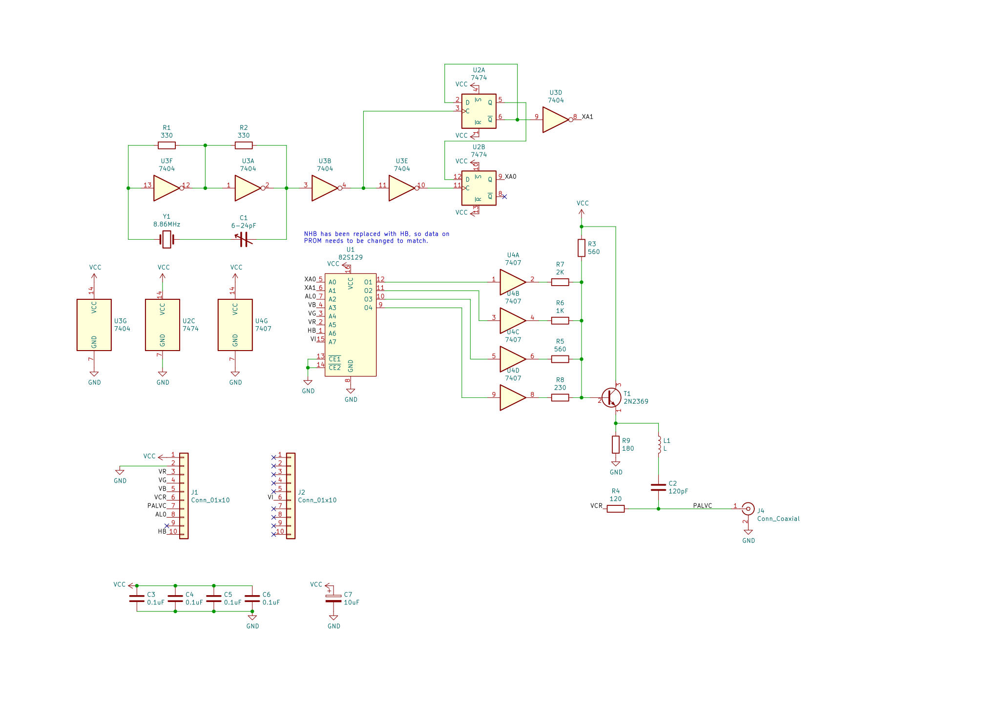

# Codor PAL v2.1 pentru Cobra

Acestea sunt fișiere KiCad pentru [Codorul PAL pentru calculatorul Cobra
analizat de YO3GHM și descris pe cobrasov.com][Codor PAL v2].

[Codor PAL v2]: http://cobrasov.com/CoBra%20Project/pal2-ro.html

Circuitul se conectează la conectorul codor PAL care există în versiune 0.2+ de
placa de bază, dar are un header suplimentar, J2, deasupra să primească signal
semnal VI.  Folosec un cablu panglică cu un singur pin să-l contectez la semnal
VI pe conectorul PAL video în spatele plăcii.

Samnal de ieșire PAL trece prin la placa de bază și de asemenea un conector
opțional BNC pe placa de circuit PAL.

O modificare notabilă versiunii documentat de YO3GHM este că în această
versiune, HB în loc de NHB întră PROMul, și conținutul PROMului trebuie să se
schimbe pentru acest.

Altfel, această revizuire ar trebuie să fi o reproducere corectă a circuitului
lui YO3GHM.

De asemnea, această revizuire folosește semnal VCR în loc de semnal VNY.

NOTĂ: Încă această revizuire nu a fost testat.  Include niște remedieri pentru
probleme în [revizuirea anterioară][5211970], care se știe că funcționa.

[5211970]: https://github.com/tsowell/cobra-palcoder-21/tree/5211970

## Imagine

Fotograful este din ultima revizuire cu remedieri.
