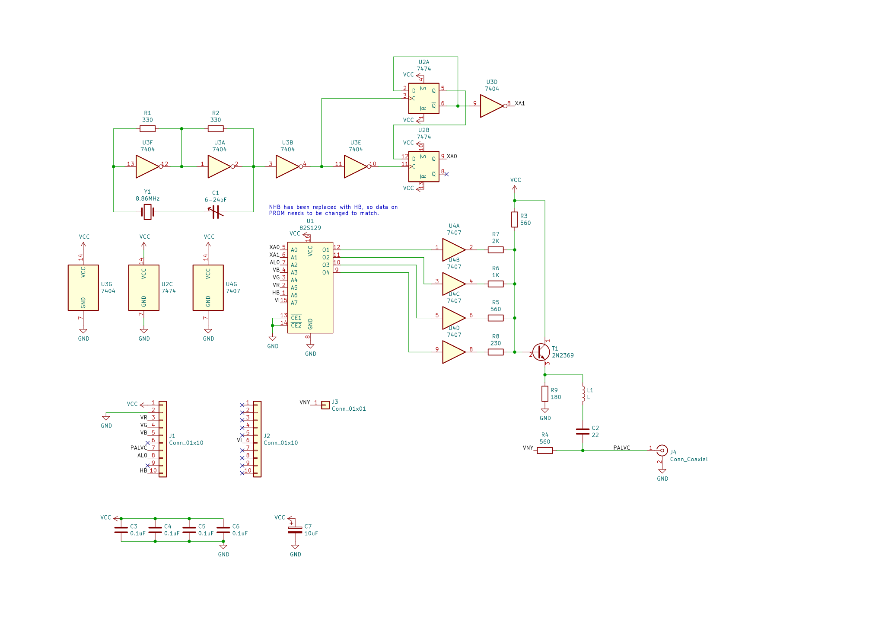

(Vezi [README-ro.md](README-ro.md) pentru o traducere greșită în română.)

# Cobra PAL Coder v2.1

These are KiCad files for the [PAL coder for the Cobra computer analyzed by
YO3GHM and described on cobrasov.com][PAL coder v2].

[PAL coder v2]: http://cobrasov.com/CoBra%20Project/pal2.html

The board connects to the PAL coder connector present on versions 0.2+ of the
motherboard, but it has an additional header, J2, on top to receive the VI
signal.  I use a one-pin ribbon cable to connect the PAL coder to the VI signal
on the video connector at the back of the motherboard.

The output PAL signal is passed through to the motherboard and also to an
optional BNC connector on the PAL board itself.

One notable modification to the version documented by YO3GHM is that this
version passes HB instead of NHB (because NHB is not on the PAL coder
connector) into the PROM, and the PROM contents must be different in order to
accomodate this.

Also, this revision uses the VCR signal from the motherboard instead of VNY.

NOTE: This revision has not been tested yet.  It includes some simple fixes for
problems in the [previous revision][5211970], which is known to work.

[5211970]: https://github.com/tsowell/cobra-palcoder-21/tree/5211970

## Images

The photograph is from the last revision with bodges.
